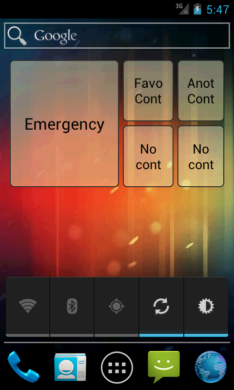
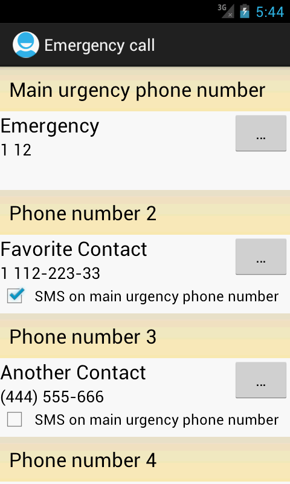
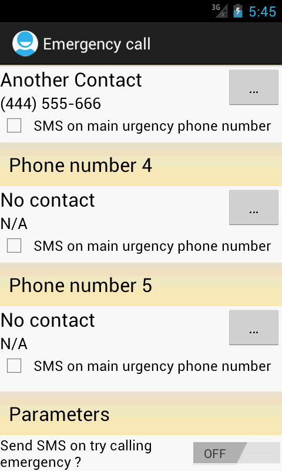

Application Urgence
=========

## Fontionnement de l'application ##

Cette Application a pour objectif de vous permettre d'appeler rapidement les secours.

Elle permet via un Widget 4x2 d'appeler les secours via le bouton principal et d'appeler rapidement 4 contacts privilégiés.

L'application principal permet de configurer et d'appeler les secours et les contacts privilégiés. Un appui long sur un contact permet de l'enlever du numéro d'urgence. Aucune action n'est évidemment effectué au niveau du contact lui-même.
L'application se base entièrement sur la liste des numéros de téléphone existant dans celui-ci.

### Appel du contact d'urgence principal ###

Ce bouton permet d'appeler les urgences (par exemple le 112 ou une personne privilégiée). Si au niveau du paramétrage des autres contacts vous avez coché la case SMS, un SMS sera envoyé avec vos coordonnées approximatives indiquant à cette personne que vous avez appelé les secours. Le(s) SMS est (sont) envoyé(s) 2 minutes plus tard lorsque vous avez appuyer sur le bouton d'appel du téléphone.  

Si l'option "Envoi d'un SMS sur tentative d'appel" est activé, un ou plusieurs SMS seront envoyés à partir du moment que vous avez appuyer sur le bouton principal d'appel. Le message sera néanmoins moins alarmiste indiquant qu'il s'agit peut-être d'une erreur.

### Appel des autres contacts ###

Les 4 boutons plus petits sont en fait des raccourcis vers vos personnes privilégiées pour les appeler directement.

## Evolutions futures ##

Cette application est gratuite et à vocation à le rester. Les sources sont disponibles sur github en faisant une recherche sur Urgence. 

L'application a été uniquement testé sur l'émulateur et sur un Samsung Galaxy S2 muni d'Android 4.0.3. Néanmoins, il ne devrait pas y avoir de problème pour qu'il tourne sur d'autres téléphones. N'hésitez pas à me laisser un message sur github pour m'indiquer un éventuel problème.

Voici les premières évolutions envisagées :

- Amélioration du "look" du Widget.
- Mettre la photo du contact dans le bouton du widget d'appel.
- Mettre à disposition du Widget sur l'écran déblocage du téléphone.
- Mettre en option la possibilité d'appeler directement les urgences sans validation.

